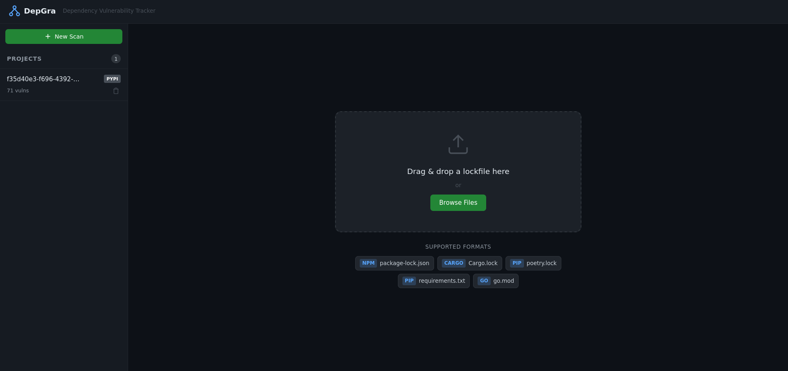
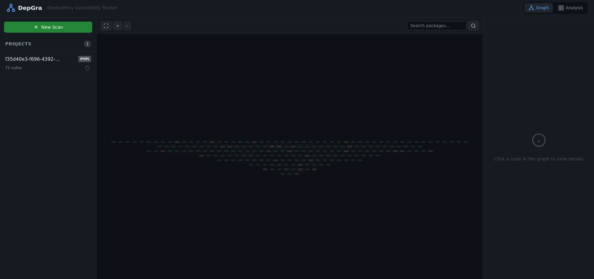
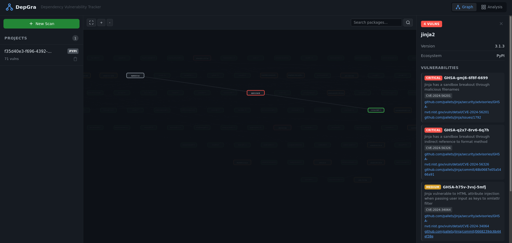
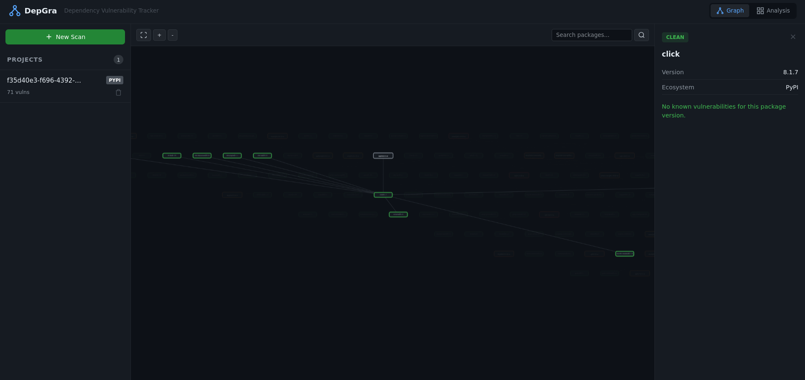
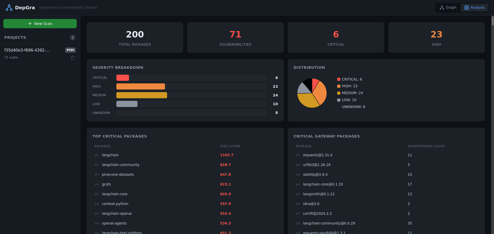
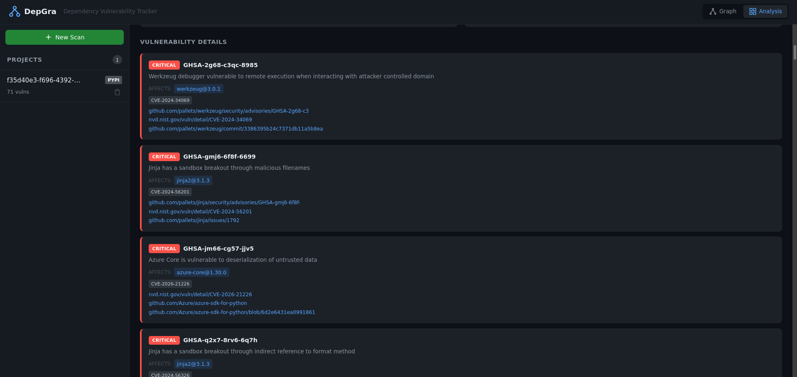

# DepGra

Dependency vulnerability tracker that visualizes your software supply chain as an interactive graph.








## Why DepGra?

Software supply chain attacks are one of the fastest-growing security threats. Log4Shell, XZ Utils, and event-stream proved that a single vulnerable dependency buried deep in your tree can compromise everything. Existing tools like `npm audit` or `pip audit` output flat lists — they tell you *what* is vulnerable but not *how* it reaches your project or *which* packages are the riskiest chokepoints.

DepGra exists to fill that gap:

- **Visualize the full dependency tree** as a top-down graph so you can see the path from your code to a vulnerability
- **Surface the packages that matter most** — the ones that sit on the most dependency paths and gateway the most vulnerabilities
- **Work across ecosystems** — one tool for npm, PyPI, Cargo, and Go instead of four different audit commands
- **Run anywhere** — no Docker, no external database, no cloud account. A single `python run.py` and you're scanning
- **Integrate into CI/CD** — the CLI mode exits non-zero when vulnerabilities exceed a severity threshold, so you can gate merges on supply chain safety

## How DepGra Compares

| Capability | `npm audit` / `pip audit` | Snyk / Semgrep | DepGra |
|---|---|---|---|
| Multi-ecosystem scanning | One ecosystem per tool | Multi (paid plans) | npm, PyPI, Cargo, Go — one tool |
| Visual dependency graph | No — flat list | Limited (SaaS only) | Interactive DAG in browser |
| Risk ranking by graph position | No — sorted by severity only | Basic priority scoring | Centrality-based — ranks chokepoint packages higher |
| Attack path visualization | No | Partial | Full path from root to vulnerable package |
| Transitive dependency resolution | Built-in for that ecosystem | Yes | Yes, including PyPI `requirements.txt` |
| CI/CD integration | `--audit-level` (npm only) | Yes (proprietary) | `--fail-on SEVERITY` for all ecosystems |
| Self-hosted / offline | Yes — runs fully local | No — cloud SaaS | Yes — runs fully local, no account needed |
| Cost | Free / open source | Free tier + paid | Free and open source |

## Features

- **4 ecosystem support** — npm, PyPI, Cargo (crates.io), and Go
- **Transitive dependency resolution** — recursively resolves the full dependency tree
- **CVE scanning** — queries OSV.dev for known vulnerabilities across all packages
- **DAG visualization** — interactive dependency graph rendered with Cytoscape.js
- **Risk scoring** — ranks packages by graph centrality and vulnerability exposure

## Quick Start

```bash
# Install
cd backend && uv venv .venv && source .venv/bin/activate && uv pip install -r requirements.txt && cd ..
cd frontend && npm install && npm run build && cd ..

# Run
python run.py
# Open http://127.0.0.1:5000
```

## CLI Usage

```bash
# Scan a lockfile
python run.py scan path/to/package-lock.json

# Fail CI if HIGH or above severity found
python run.py scan requirements.txt --fail-on HIGH

# Export results
python run.py scan Cargo.lock --export json --output results.json
```

## Supported Lockfiles

- `package-lock.json` (npm)
- `Cargo.lock` (crates.io)
- `poetry.lock` (PyPI)
- `requirements.txt` (PyPI)
- `go.mod` (Go)

## Architecture

DepGra is split into a Python backend and a Svelte frontend:

- **Backend** — Flask REST API backed by SQLite for persistence and NetworkX for in-memory graph analysis. Parses lockfiles, resolves transitive dependencies, queries the OSV.dev API for CVE data, and computes risk scores.
- **Frontend** — Svelte single-page application that renders the dependency graph as an interactive DAG using Cytoscape.js. Communicates with the backend via REST endpoints.
- **Data flow** — A lockfile is uploaded (or scanned via CLI), parsed into a package list, ingested into SQLite, enriched with CVE data from OSV.dev, and then served to the frontend for visualization and analysis.

## License

MIT
